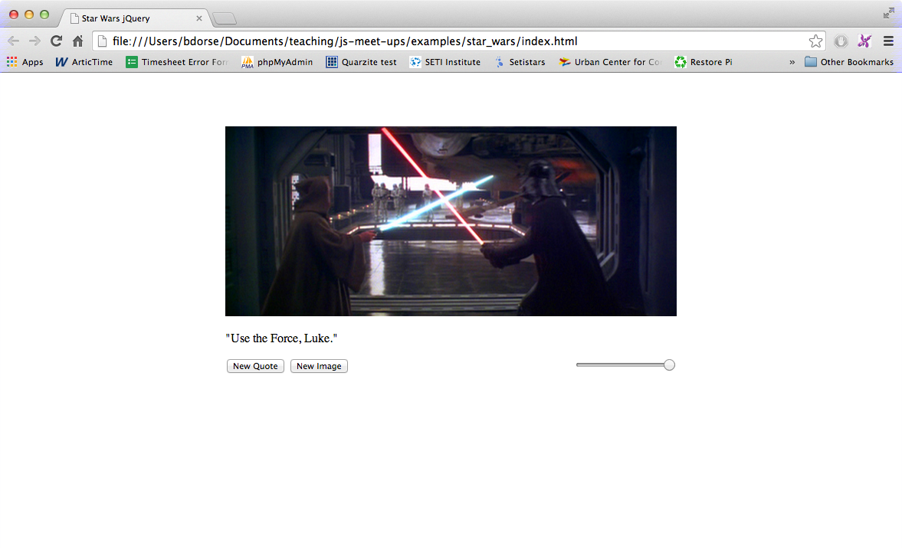

# Week 2

## The DOM

The Document Object Model (DOM) is a programming interface for HTML and XML documents. It provides a structured representation of the document and it defines a way that the structure can be accessed from programs so that they can change the document structure, style and content. The DOM provides a representation of the document as a structured group of nodes and objects that have properties and methods. Essentially, it connects web pages to scripts or programming languages. More info [where the above was taken from](https://developer.mozilla.org/en-US/docs/DOM/DOM_Reference/Introduction).

```html
<html>

  <head>
  	<script src="path/to/javascript/script.js"></script>
  </head>
  
  <body>
  	<p>
  		This is a paragraph. We can easily manipulate the content of this
  		paragraph using javascript.
  	</p>
  	<p>
  		This is another paragraph.
  	</p>
  </body>
  
</html>

```

```javascript

paragraphs = document.getElementsByTagName("p");
// paragraphs[0] is the first <p> element
// paragraphs[1] is the second <p> element, etc.
alert(paragraphs[0].nodeName);

```

Most of the time manipulating elements by their tag name is far too general for practical purposes. For this reason, JavaScript has a semi-convenient method for targeting elements by their `id`s:

```javascript
document.getElementById("nameOfID");
```

For instance, we could easily change the text on an html page by selecting a specific elements id. This time lets embed the javascript code inside of the html page itself change the text in the `id=bar` paragraph 1 second after the page loads:

```html
<html>

  <head>
  	<script type="text/javascript">
      
      //when the window has loaded
      window.onload = function(){

        setTimeout(function(){
           var bar = document.getElementById("bar");
           bar.innerHTML = "I changed this text 1 second after the page loaded.";
        }, 1000);
       
      }
      
    </script>
  </head>
  
  <body>
  	<p>
  		This Paragraph doesn't have any id.
  	</p>
  	<p id="foo">
  		This Paragraph doesn't have the id that we are selecting.
  	</p>
  	<p id="bar">
  		This one does, it will be changed.
  	</p>
  </body>
  
</html>
```

JavaScript (in the web browser) gives you access to two extra important global objects through the DOM. They are the:

- [Document](https://developer.mozilla.org/en-US/docs/Web/API/document): represents the web page
- [Window](https://developer.mozilla.org/en-US/docs/Web/API/Window): represent the browser's window.

Together, the HTML Document Object Model and JavaScript make up an Application Programming Interface (API). Here is a list of just a few of the __many__ ways that you can use the DOM to manipulate HTML on a webpage with JavaScript. For a full list of the DOM's properties, methods, and event handlers check out [this documentation](http://www.w3schools.com/jsref/dom_obj_document.asp).

- `document.getElementById(id)`
- `element.getElementsByTagName(name)`
- `document.createElement(name)`
- `parentNode.appendChild(node)`
- `element.innerHTML`
- `element.style.left`
- `element.setAttribute`
- `element.getAttribute`
- `element.addEventListener`
- `window.content`
- `window.onload`
- `window.scrollTo`

## jQuery

Because manipulating the DOM is actually quite tedious with its arbitrary long and arduous method names and broken down low level API, jQuery was created to make DOM manipulation as easy as "using a nice little library that fixes all of your DOM problems."

jQuery is a library that extends and simplifies the regular JavaScript DOM API and comes with tons of helper methods. To use it simple add this (or a link to whatever version you want to use) to your html page:

```html
<script src="http://ajax.googleapis.com/ajax/libs/jquery/1.11.0/jquery.min.js" >
// load jQuery 
</script>
```

Just make sure that you load it before you start to use it. For now just put it inside of your `<head>` tag.

jQuery uses a `$` character to define its own [namespace](http://en.wikipedia.org/wiki/Namespace). For now all that you need to know is that that means that whenever we use a jQuery object or method we prepend it with `$`. Like this:

```javascript
$("#idName").text("some text");
```

The string inside of the `$()` parenthesis is a CSS selector used to query the DOM. This means that the javascript for the above `id="bar"` example could easily be rewritten using jQuery like this:

```javascript

// when the document is ready. Better than window.onload.
$(document).ready(function(){

	setTimeout(function(){
       $("#bar").text("I changed this text 1 second after the page loaded.");
    }, 1000);
});

```

This time we used jQuery's `$(document).ready()` function instead of `window.onload`. That is because `$(document).ready()` occurs as early as possible after the document has loaded (more [here](http://stackoverflow.com/questions/3698200/window-onload-vs-document-ready)). Whenever you have code that you want to run when the page is ready, put it inside of a `$(document).ready()`.

A full list of CSS selectors can be found [here](http://www.w3schools.com/cssref/css_selectors.asp), however you can get started knowing just the following:

- Element name: Simply the name of the HTML element that you want to select (e.g. `div`). This returns an array of jQuery objects that represent each element of that name.
- Class: Elements with a class can be targeted by prepending the class name with a `.` character (e.g. `#custom-class`). Because multiple html elements can have the same class name this target often returns an array of jQuery objects.
- Id: Elements with an id can be targeted by prepending the id name with a `#` character (e.g. `#custom-id`). Because there can only be one id for each html element this type of target is guaranteed to return only 1 jQuery result object.


## Example



Download and open this jQuery [Star Wars example](../examples/star_wars) to get a feel for some jQuery/JavaScript DOM manipulation in action! It uses jQuery to easily handle the switching of images and text as well as the slider's opacity control.

## More Basics

Check out the [Loops](../basics/loops.md) and [Functions](../basics/functions.md) basics sections for more info on helpful javascript and programming concepts.
